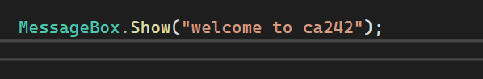

## this readme demonstrates the explanation of the codes which are in the screenshots.

# 

> This example demonstrates how to display a message to the user using the MessageBox.Show() method in a C# Windows Forms application.

The MessageBox.Show() method is used to display a dialog box containing a message.

In this example, the program displays the message “welcome to ca242” in a pop-up window.

The message is enclosed in double quotation marks because it is a string literal.

How It Works

1. The program executes the MessageBox.Show() method.
2. The text inside the quotation marks is passed as an argument.
3. A message box appears on the screen.
4. The user can read the displayed message and dismiss the dialog box.

# 

> This example demonstrates how to identify and handle syntax errors in a C# program using Visual Studio.

A syntax error occurs when code violates the grammatical rules of the C# programming language.

In this example, Visual Studio highlights a problem in the MessageBox.Show() statement using a red underline.

The red underline indicates that the IDE has detected an issue that needs to be investigated and corrected.

How It Works

1. The programmer writes a statement in the Code Editor.
2. Visual Studio analyzes the code and detects potential errors.
3. A red underline highlights the problematic part of the statement.
4. The programmer examines the highlighted code and checks the error information.
5. The issue is corrected, and the program can be built again.

> Important Concepts

* Syntax Error: A mistake that violates the grammatical rules of a programming language.
* Code Editor: The area in Visual Studio where programmers write and edit source code.
* Red Underline: A visual indicator used by Visual Studio to highlight detected code issues.
* Error List: A Visual Studio window that provides information about detected errors and warnings.
* Debugging: The process of identifying, investigating, and correcting problems in a program.

> Common Causes of Syntax Errors

* Missing semicolons.
* Incorrect spelling of keywords, methods, or identifiers.
* Missing or mismatched parentheses.
* Missing quotation marks.
* Incorrect use of programming language syntax.

# .png>)

> This example demonstrates how to close the current form in a C# Windows Forms application using the Close() method.

The this.Close() statement is used to close the current form.

The keyword this refers to the current instance of the form, while the Close() method requests that the form be closed.

This functionality is commonly used when creating Exit or Close buttons in Windows Forms applications.

How It Works

1. The program executes the this.Close() statement.
2. The this keyword refers to the current form.
3. The Close() method is called.
4. The current form is closed.

Important Concepts

* this Keyword: Refers to the current instance of a class.
* Close() Method: Closes the current form.
* Form: A window that provides the user interface of a Windows Forms application.
* Method: A block of code that performs a specific operation.

Practical Application

The Close() method can be used to:

* Close a form when the user clicks an Exit button.
* Close a secondary window after completing an operation.
* Allow users to leave the current form.

Important Note

The this.Close() statement closes the current form. It is different from Application.Exit(), which requests that the entire application terminate.

